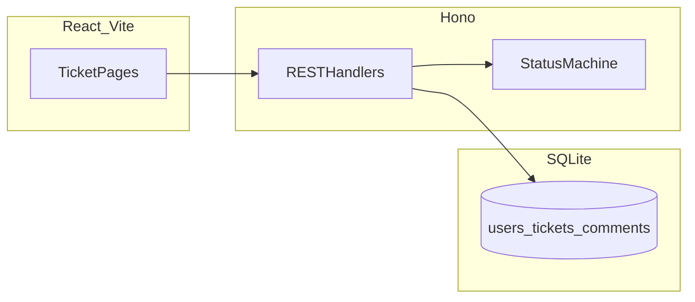

# Design notes

## Architecture overview

- **Client:** React SPA served by Vite during development; calls `/api/*` (proxied to Hono in dev).
- **Server:** Hono on Bun, Drizzle ORM over `bun:sqlite`.
- **Database:** SQLite file (`DATABASE_PATH`), foreign keys enabled.

## Frontend design

- React Router for `/`, `/tickets/new`, `/tickets/:id`.
- Tailwind for layout and feedback states.
- `allowedNextStatuses` mirrors server transitions to avoid offering illegal buttons.

## Backend design

- Thin route handlers; business rules for status transitions centralized in `status-machine.ts`.
- Drizzle for parameterized queries; `LIKE` patterns built with stripped `%`/`_` from user input to reduce accidental wildcard injection.

## Database design

- Integer primary keys, unix-ms timestamps, `ON DELETE CASCADE` from tickets to comments.
- Indexes on `tickets.status`, `tickets.assigned_to`, `comments.ticket_id`.

## Validation strategy

- **Inbound JSON:** Zod schemas per endpoint.
- **Status:** `isTicketStatus` + `assertValidTransition` before update.

## Error handling strategy

- Consistent JSON errors (`code`, `message`, optional Zod `details`).
- HTTP `409` for illegal transitions; `400` for validation; `404` for missing ticket.

## Testing strategy link

See [`test-strategy.md`](test-strategy.md) and [`tests/status-machine.integration.test.ts`](tests/status-machine.integration.test.ts).
